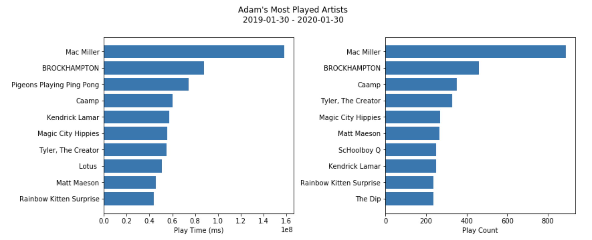
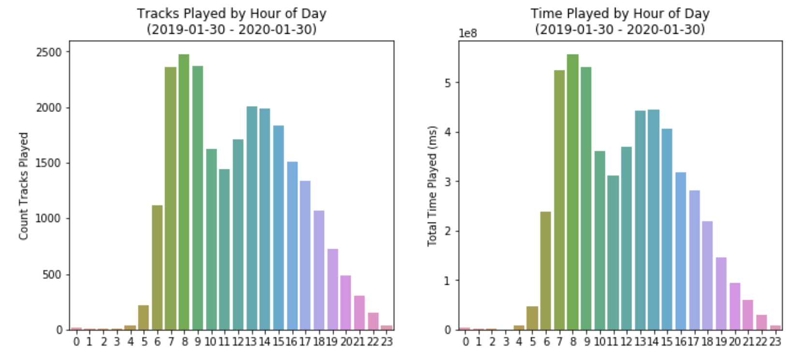
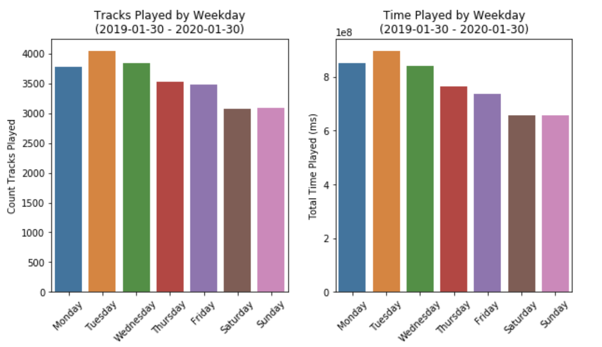

# Spotify EDA

Repo to analyze my data downloaded from Spotify.  You can download yours [here](https://www.spotify.com/us/account/privacy/).

So far all, analysis has been done in [stream_history_eda.ipynb](stream_history_eda.ipynb).  Plans to analyze song lyrics as well.  All song data was downloaded from Genius with the `lyricsgenius` package.  A [zip of the song data is on my google drive](https://drive.google.com/file/d/1vKjkOiZn1szeC1cw67svFYMKh9WjyVhI/view?usp=sharing).

## Highlights

#### Pigeons Playing Ping Pong have long songs

The band Pigeons Playing Ping Pong appear in my top 3 most listened to artists by play time, but they don't appear in my top 10 by play count.

   

#### My listening habits are driven by work, not pleasure

I listen to Spotify the most during the work times of day and on weekdays.  Saturday and Sunday have the least amount of plays, and my playtime falls off drastically after 4pm.

   

   

